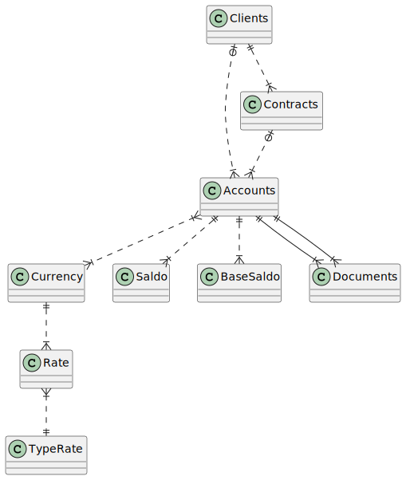

# db-balance

Regular **Markdown** here.

<!--
@startuml er

Clients   |o..|{ Accounts
Clients   ||..|{ Contracts
Contracts |o..|{ Accounts
Accounts  }|..|{ Currency
Currency  ||..|{ Rate
Rate      }|..|| TypeRate   
Accounts  ||..|{ Saldo
Accounts  ||..|{ BaseSaldo
Accounts  ||--|{ Document
Accounts  ||--|{ Document
@enduml
-->

Some more markdown.
